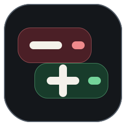
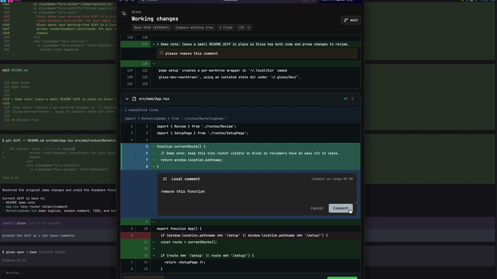

<p align="center">
  
</p>

# Gloss

[](https://github.com/iamrajjoshi/gloss/releases)
[](https://www.npmjs.com/package/getgloss)
[](https://github.com/iamrajjoshi/gloss/actions/workflows/ci.yml)
[](https://github.com/iamrajjoshi/gloss/blob/main/LICENSE)

Gloss is a local browser review loop for coding agents. It captures your current
git diff, opens a localhost review UI, lets you attach comments to changed
lines or ranges, and writes structured feedback under `~/.gloss` for an agent
to re-ingest.

## Demo

[](public/gloss-demo.mp4)

[Watch the Gloss demo video](public/gloss-demo.mp4).

## Install

```bash
brew install iamrajjoshi/tap/gloss
gloss open --json
```

With npm:

```bash
npm install -g getgloss
gloss open --json
```

For one-off use:

```bash
npx getgloss open --json
```

For a new agent chat, use:

```text
Install Gloss with Homebrew or npm. Then read https://getgloss.dev/setup.md.
```

### Claude Code Skill

Gloss ships a packaged Claude Code skill at `skill/SKILL.md`. Install it with
the [`skills` CLI](https://github.com/vercel-labs/agent-skills):

```bash
# Global (available across all projects)
npx skills add iamrajjoshi/gloss --skill gloss -g -a claude-code

# Project-local (only inside the current project)
npx skills add iamrajjoshi/gloss --skill gloss -a claude-code
```

`-g` installs to `~/.claude/skills/`, `-a claude-code` targets Claude Code, and
`--skill gloss` installs only the Gloss skill folder from the repo. The skill
teaches agents to run `gloss open --json`, wait for browser submission, read
`feedbackPath`, apply comments, validate, continue the same review with
`gloss open --review <reviewId> --json`, and mark comments or turns resolved
with `gloss resolve`.

The hosted install script installs the npm package:

```bash
curl -fsSL https://getgloss.dev/install.sh | sh
```

## Commands

```text
gloss open [--base <ref>] [--review <reviewId>] [--print-url] [--no-open] [--json] [--no-watch] [--timeout <s>]
gloss watch <reviewId>
gloss resolve <reviewId> [--comment <commentId>] [--turn <id-or-index>] [--summary <text>] [--json]
gloss start [--port <port>]
gloss status
gloss stop [--all]
gloss doctor
```

`gloss open` lazy-starts a background server, captures staged, unstaged, and
untracked working changes, registers a review session, opens
`http://localhost:<port>/review/<reviewId>`, and waits for submission unless
`--no-watch` is passed. When the working tree is clean and no explicit
`--base` is provided, Gloss falls back to the current branch diff against the
best available merge-base from upstream, `origin/HEAD`, `origin/main`, or
`origin/master`.

Use `--base <ref>` when you want an explicit comparison. Explicit base mode
compares only against the requested ref and does not switch to a branch diff.

`gloss open --json` waits until the browser review is submitted. Use
`--no-watch` when a caller only needs to open the review and return immediately.
Use `gloss open --review <reviewId> --json` after applying feedback to capture
the next diff as another turn in the same browser review.
The background server exits automatically after a short idle window with no
live review clients. Pending review artifacts stay on disk and can be resumed,
but they do not keep the daemon alive by themselves. `gloss doctor` reports
unmanaged daemon processes, and normal startup/status commands also clean up
clearly stale daemons. `gloss stop --all` cleans up every Gloss daemon for the
current user.

You do not need to unlock `~/.gloss/server.json` after finishing a review.
That file is only the background daemon pointer, not a review lock. If a
command reports a permission error while cleaning it up, run `gloss doctor`,
then try `gloss stop --all` from a normal terminal. If macOS flags made the
file immutable, inspect with `ls -lOe ~/.gloss ~/.gloss/server.json` and clear
the flag with `chflags nouchg ~/.gloss/server.json`. For sandboxed agents, set
`GLOSS_STATE_DIR` to a writable directory.

`gloss clear` deletes completed review artifacts older than 30 days from
`~/.gloss/reviews` while always preserving pending reviews. Use
`gloss clear --dry-run` to preview candidates, or `--older-than <days>` to
choose a different retention window.

## Review UI

In the browser review, drag over a changed line or range to open a draft
comment. Use `Command+Enter` to save the active draft comment. Use
`Command+Shift+Enter` to submit the review; this matches the Submit button and
includes already-saved comments only.

When branch reviews include per-commit diffs, the commit picker changes only the
current preview. Gloss persists that selected scope when the review is submitted,
so `feedback.json` records whether the human reviewed all commits, one commit, or
a contiguous commit range.

## Feedback Files

Submitted reviews are written to:

```text
~/.gloss/reviews/<reviewId>/
  meta.json
  turns/
    <turnId>/
      turn.json
      diff.json
      feedback.json
      feedback.md
      resolved.json
```

`feedback.json` is the machine-readable payload and includes `reviewScope` for
submitted commit-preview scope. `feedback.md` is a readable summary ordered by
file and line. `resolved.json` is mutable resolution progress for individual
comments and the turn. After applying feedback, use
`gloss resolve <reviewId> --comment <commentId> --summary "..."` for a single
comment or `gloss resolve <reviewId> --turn <id-or-index> --summary "..."` for a
specific turn. Without `--turn`, whole-review resolution targets the latest
turn. Set `GLOSS_STATE_DIR` to use an isolated state root for tests or
development.
For a follow-up pass after fixes or new commits, continue the same review with
`gloss open --review <reviewId> --json`.

## Development

```bash
pnpm dev:web
pnpm build
pnpm test
pnpm check
pnpm setup
```

`pnpm setup` creates a per-worktree wrapper in `~/.local/bin` named
`gloss-dev-<worktree>`, using an isolated state dir under `~/.gloss/dev/`.

## Release Flow

Releases follow Willow's tag-driven shape:

1. Push a tag like `v0.1.0`.
2. GitHub Actions runs checks, tests, and the production build.
3. The package is published to npm as `getgloss`.
4. A GitHub release is created with `npm pack` output and checksums.
5. The Homebrew formula is updated in `iamrajjoshi/homebrew-tap`.

Required repository secrets:

- `NPM_TOKEN`
- `HOMEBREW_TAP_GITHUB_TOKEN`
